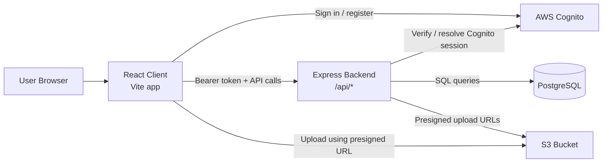
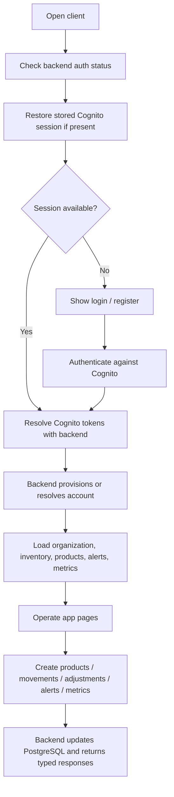
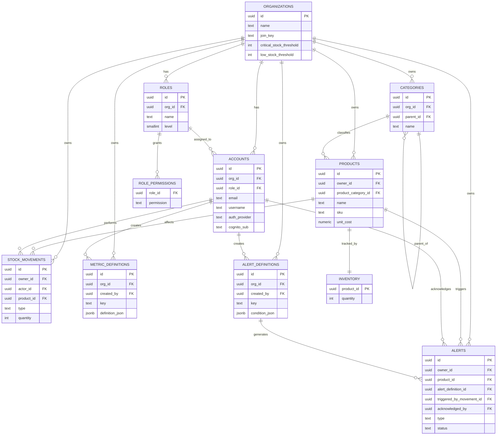

# Indigo Ledger

Cloud-based inventory management system with a React client, a Node.js/Express API, and a PostgreSQL database.

## Overview

This repository contains:

- `client/`: React 19 + Vite frontend
- `backend/`: TypeScript + Express API
- `database/`: PostgreSQL schema and seed SQL
- `postman/`: API request collections and local environment files

Core capabilities currently implemented in the repo:

- Cognito-based authentication and backend account resolution
- Organization-scoped roles and permissions
- Product and category management
- Inventory balances, movements, and manual adjustments
- Dashboard metrics and custom metric definitions
- Alert definitions and persisted alert records
- S3 presigned upload support for product/profile images

## Tech Stack

- Frontend: React, TypeScript, Vite, React Router, Recharts
- Backend: Node.js 22, Express 5, TypeScript, Zod, `pg`
- Database: PostgreSQL 15
- Infra tooling: Docker, Docker Compose
- Auth: AWS Cognito
- Object storage: AWS S3

## Repository Structure

```text
.
├─ backend/                 # API server, modules, DTOs, tests
├─ client/                  # React SPA
├─ database/                # SQL schema and seed files
├─ postman/                 # Postman assets
├─ docker-compose.yml       # Local multi-container setup
└─ COGNITO_CONFIRMATION_EMAIL_TEMPLATE.html
```

## Architecture



## Main Application Flow



## Database Schema



## Prerequisites

- Node.js 22+
- npm
- Docker Desktop / Docker Engine with Compose
- PostgreSQL client tools if you want to inspect the DB manually
- AWS Cognito configuration for the current frontend auth flow

## Environment Setup

### Backend

Create `backend/.env` from `backend/.env.example`.

Minimum local values:

```env
PORT=3000
DB_HOST=localhost
DB_PORT=5432
DB_NAME=inventory
DB_USER=postgres
DB_PASSWORD=password
APP_UUID_SALT=replace-me
JWT_SECRET=replace-me
BCRYPT_ROUNDS=10
AUTH_BACKEND_API=replace-with-base64-backend-api-key
AUTH_ENABLE_BACKEND_API_BYPASS=false
AWS_REGION=us-east-1
COGNITO_USER_POOL_ID=replace-me
COGNITO_CLIENT_ID=replace-me
S3_PRODUCT_IMAGE_BUCKET=replace-me
S3_PRODUCT_IMAGE_PUBLIC_BASE_URL=
DEMO_DEFAULT_ORG_ENABLED=false
DEMO_DEFAULT_ORG_NAME=Developer Workspace
DEMO_DEFAULT_ROLE_NAME=Developer
CORS_ALLOWED_ORIGINS=http://localhost:5173,http://localhost:3000
```

Notes:

- The backend supports either split `DB_*` settings or a single `POSTGRES_SSL_URL` / `DATABASE_URL` / `POSTGRES_URL`.
- The current frontend auth flow expects Cognito to be configured.
- S3 settings are required for image-upload features.

### Client

Create `client/.env` from `client/.env.example`.

For local development, use values like:

```env
VITE_API_BASE_URL=http://localhost:3000
VITE_COGNITO_USER_POOL_ID=replace-me
VITE_COGNITO_CLIENT_ID=replace-me
```

Important:

- The checked-in `client/.env.example` currently points at a deployed API, not local backend defaults.
- The client Docker image bakes env vars at build time. If your API/Cognito values change, rebuild the image.

## Quick Start

1. Create `backend/.env`.
2. Create `client/.env`.
3. Start PostgreSQL.
4. Apply the schema SQL.
5. Optionally apply the seed SQL.
6. Start backend and client.

## Local Development

### 1. Start PostgreSQL

From the repo root:

```bash
docker compose up -d db
```

### 2. Initialize the database

The database container does **not** automatically apply the schema or seed files. Run them manually.

Schema:

```powershell
Get-Content .\database\db_schema_with_alerts.sql | docker exec -i inventory_db psql -U postgres -d inventory
```

Optional seed:

```powershell
Get-Content .\database\db_seed_with_alerts.sql | docker exec -i inventory_db psql -U postgres -d inventory
```

### 3. Run the backend

```bash
cd backend
npm install
npm run dev
```

Backend endpoints:

- App root: `http://localhost:3000`
- Health check: `http://localhost:3000/api/health`

### 4. Run the client

In another terminal:

```bash
cd client
npm install
npm run dev
```

Client URL:

- `http://localhost:5173`

## Run Everything with Docker

### Local Docker Compose

From the repo root:

```bash
docker compose up --build
```

This starts:

- `inventory_db` on `5432`
- `inventory_backend` on `3000`
- `inventory_client` on `5173`

Before using the app, initialize the database:

```powershell
Get-Content .\database\db_schema_with_alerts.sql | docker exec -i inventory_db psql -U postgres -d inventory
```

Optional:

```powershell
Get-Content .\database\db_seed_with_alerts.sql | docker exec -i inventory_db psql -U postgres -d inventory
```

Important caveats for the current Docker setup:

- `docker-compose.yml` loads runtime env vars for the backend from `backend/.env`.
- The client container does not read `client/.env`; its values come from `client/Dockerfile` at build time.
- The current client Dockerfile is preconfigured with deployed AWS values, so you should update it or pass equivalent build-time values before treating it as a true production image.

## Production-Style Docker Workflow

This repo does not include a dedicated production compose file, reverse proxy, or secret manager wiring. The closest safe approach is:

### Build images

```bash
docker build -t indigo-ledger-db ./database
docker build -t indigo-ledger-backend ./backend
docker build -t indigo-ledger-client ./client
```

### Run containers

Database:

```bash
docker run -d --name inventory_db -p 5432:5432 -e POSTGRES_USER=postgres -e POSTGRES_PASSWORD=password -e POSTGRES_DB=inventory indigo-ledger-db
```

Backend:

```bash
docker run -d --name inventory_backend -p 3000:3000 --env-file ./backend/.env indigo-ledger-backend
```

Client:

```bash
docker run -d --name inventory_client -p 5173:5173 indigo-ledger-client
```

Recommended production hardening outside the current repo:

- Use a managed PostgreSQL instance instead of the local DB container
- Inject secrets through your platform, not checked-in env files
- Rebuild the client image with production `VITE_*` values
- Put the client/backend behind HTTPS and a reverse proxy or load balancer
- Add persistent logging, monitoring, backups, and container health policies

## Available Scripts

### Backend

```bash
npm run dev
npm run build
npm run start
npm test
```

### Client

```bash
npm run dev
npm run build
npm run preview
```

## API Surface

Main backend route groups under `/api`:

- `/auth`
- `/users`
- `/organizations`
- `/categories`
- `/inventory`
- `/products`
- `/metrics`
- `/alerts`
- `/uploads`

Useful endpoints:

- `GET /api/health`
- `GET /api/auth/cognito`
- `POST /api/auth/cognito/resolve`
- `GET /api/products`
- `GET /api/inventory`
- `POST /api/inventory/movements`
- `GET /api/metrics/inventory/overview`
- `GET /api/alerts`

Postman assets are included under [`postman/`](./postman/).

## Testing

Backend tests:

```bash
cd backend
npm test
```

The repository currently contains backend unit/service tests for auth, users, organizations, products, inventory, metrics, and alerts.

## Known Caveats

- The DB schema and seed files are manual steps; they are not wired into container startup.
- The frontend currently uses Cognito-first auth. Local usage without valid Cognito config will not match the main UI flow.
- S3 upload features require valid AWS configuration.
- The checked-in client Dockerfile contains hardcoded deployed `VITE_*` defaults and should be reviewed before production use.

## Future Improvements

- Add automated DB initialization or migrations
- Add a dedicated production compose or deployment manifest
- Move client build-time config into a clearer release workflow
- Add CI for tests and image builds
- Add reverse proxy and TLS termination examples

## License

MIT
